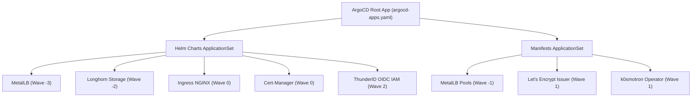

# 🎭 OpenChoreo Platform AI Demo — GitOps Infrastructure

Repositório de infraestrutura **declarativo e versionado (GitOps na veia)** orquestrado via **ArgoCD**, projetado para prover uma plataforma moderna de **Internal Developer Platform (IDP)** com **OpenChoreo**, **k0smotron (Hosted Control Planes)** e **ThunderID (IAM / OIDC)**.

---

## 🏛️ Arquitetura da Plataforma

A plataforma utiliza o padrão **App-of-Apps / ApplicationSet** do ArgoCD para reconciliação determinística de toda a stack.



---

## ⚡ Ordem de Sincronização (Sync Waves)

Para evitar falhas de CRDs ou dependências de rede e armazenamento, a reconciliação segue a seguinte cadência:

| Wave | Componente | Tipo | Função |
| :---: | :--- | :---: | :--- |
| **`-3`** | `metallb` | Helm | Operator de rede e infra BGP/L2 |
| **`-2`** | `longhorn` | Helm | Storage distribuído (Réplicas = 2) |
| **`-1`** | `metallb-config` | Manifest | Configura os pools `ingress-pool` e `general-pool` |
| **`0`** | `ingress-nginx` | Helm | Ingress Controller (Segura o IP `164.152.58.109`) |
| **`0`** | `cert-manager` | Helm | Gestão de Certificados TLS (`installCRDs: true`) |
| **`1`** | `letsencrypt` | Manifest | `ClusterIssuer` ACME com suporte a HTTP-01 e DNS-01 (Cloudflare) |
| **`1`** | `k0smotron` | Manifest | Operator para Hosted Control Planes (Kubernetes/k0s como pods) |
| **`2`** | `thunderid` | Helm | IAM / Identity Provider (OIDC / OAuth2) rodando com SQLite + PVC Longhorn |

---

## 🌐 Estratégia de Rede e DNS (Cloudflare)

A infraestrutura utiliza uma arquitetura **Dual-Gateway**:
1. **Ingress NGINX (`164.152.58.109`)**: Dedicado à infraestrutura base e ao plano de autenticação (ThunderID).
2. **KGateway / Gateway API (`168.75.80.191`)**: Dedicado às rotas de data plane do OpenChoreo (`console`, `api`, `observer` e apps dos desenvolvedores).

### Tabela de Apontamentos DNS (Zona `rootexmachina.com`):

| Tipo | Registro / Subdomínio | IP Alvo | Proxy Status | Componente |
| :---: | :--- | :---: | :---: | :--- |
| **A** | `auth.choreo` | **`164.152.58.109`** | DNS Only (Cinza) | **ThunderID** (Identity / SSO) |
| **A** | `console.choreo` | **`168.75.80.191`** | DNS Only (Cinza) | **OpenChoreo Console** (via KGateway) |
| **A** | `api.choreo` | **`168.75.80.191`** | DNS Only (Cinza) | **OpenChoreo API** (via KGateway) |
| **A** | `observer.choreo` | **`168.75.80.191`** | DNS Only (Cinza) | **OpenChoreo Telemetria** (via KGateway) |
| **A** | `apps.choreo` | **`168.75.80.191`** | DNS Only (Cinza) | Domínio base de workloads |
| **A** | `*.apps.choreo` | **`168.75.80.191`** | DNS Only (Cinza) | Apps dinâmicos dos Desenvolvedores |

---

## 📂 Estrutura do Repositório

```text
platform-ai-demo/
├── argocd/
│   ├── argocd-apps.yaml                 # Root Application (App-of-Apps)
│   ├── argocd-apps/
│   │   ├── helm-charts-appset.yaml      # ApplicationSet para Helm Charts
│   │   └── manifests-appset.yaml        # ApplicationSet para Manifestos GitOps
│   └── gitops/
│       ├── helm/                        # Helm Charts locais / extensões
│       └── manifest/
│           ├── k0smotron/
│           │   └── kosmotron.yaml       # CRDs e Operator k0smotron
│           ├── letsencrypt/
│           │   └── letsencrypt-prod.yaml# ClusterIssuer ACME / Cloudflare DNS-01
│           └── metallb/
│               ├── ipaddresspool.yaml   # Pools de IP (ingress-pool & general-pool)
│               └── l2advertisement.yaml # Anúncio Layer 2 MetalLB
└── README.md
```

---

## 🚀 Como Fazer o Bootstrap no Cluster

### 1. Pré-requisito: Secret do Cloudflare API Token
Antes de sincronizar a stack, crie o Secret com o Token da API do Cloudflare no namespace `default` (ou onde o ClusterIssuer for resolver o DNS-01):

```bash
kubectl create secret generic cloudflare-api-token-secret \
  --from-literal=api-token="SEU_CLOUDFLARE_API_TOKEN" \
  -n default
```

### 2. Aplicar o Application Raiz no ArgoCD

```bash
kubectl apply -f argocd/argocd-apps.yaml
```

O ArgoCD criará os ApplicationSets e orquestrará todos os deployments respeitando rigorosamente as Sync Waves! ⚡
